&lt;&lt;HandgeschriebeneFormelsammlung.pdf>&gt;

Digitaltechnik

Donnerstag, 18. Februar 2021

14:12

 

# Grundlagen

-   *Signale*

<!-- -->

-   Information steckt in sich ändernden Amplitudenwerten über einen Zeitlichen verlauf

-   Analogtechnik

    -   Zeit- und Wert kontinuierlich

    -   Klassischer Graph (x = Zeit, y = Wert, jeder x genau einen y)

-   Digitaltechnik

    -   Zeit- und Wertdiskret

    -   Nur Stufenweise Darstellung, kein linenförmiger Graph

        -   Uq - Quantisierter Spannungsverlauf (Ist aber ein Analoger Wert, aber der Zeiger kann nur auf bestimmte Werte Zeigen)

    -   Meist langsamer als Analogtechnik; aber Schaltungen sind einfacher aufzubauen (boolesche Algebra), und es gibt keine Fehlerfortpflanzungen

<!-- -->

-   *Schaltsymbole*

<!-- -->

-   Rechteck mit Symbol in der Mitte, Eingangssignalen und Ausgangssignalen

    -   Ggf. Markierungen an den Ausgängen --> Kreise für Negation

-   

<table><colgroup><col style="width: 24%" /><col style="width: 31%" /><col style="width: 43%" /></colgroup><thead><tr class="header"><th>Eingangsbuchstabe</th><th>Funktion</th><th>Beschreibung</th></tr></thead><tbody><tr class="odd"><td>G</td><td>"und" Abhängigkeit</td><td>Alle Eingänge mit der Zahl werden mit dem Eingang G-Zahl verknüpft und am Ausgang mit der Nummer ausgegeben</td></tr><tr class="even"><td>¬</td><td>Invertierung/ Negierung</td><td>Eingang wird negiert an den Ausgang mit der selben Nmmer ausgegeben</td></tr><tr class="odd"><td>V</td><td>"oder" Abhängigkeit</td><td>S.o.</td></tr><tr class="even"><td>N</td><td>"xor" Abhängigkeit</td><td> </td></tr><tr class="odd"><td>Z</td><td>Verbindungsabhänigkeit</td><td>Ein Eingang mit Zx ist direkt mit Ausgang x Verbunden</td></tr><tr class="even"><td>X</td><td>Übertragungsabhänigkeit</td><td>Ist der Eingang X1 HIGH, sind alle mit 1 gekennzeichneten Ausgänge bidirektional verbunden (sonst isoliert)</td></tr></tbody></table>

-   *Verhalten Gatter*

<!-- -->

-   Gehen im Idealfall von Rechteckigen Verlaufen der Ausgangsspannungen aus

    -   Schaltet der Eingang der Inverters auf HIGH, ist dieser sofort auf VDD und der Ausgang springt sofort von VDD auf 0V

-   Tatsächlich gibt es Nebeneffekte (z.B. Rauschen) und die Graphen sind abgerundet, Zusätzlich gibt es Zeitverzögerungen

-   Gatter basieren auf Transistoren

    -   TTL - Transistor-Transistor Logik

    -   CMOS - Complementary Metal Oxide Semiconductor

-   Verzögerungen

    -   Dauer, die ein Gatter benötigt wird um von 10% von Umax auf 90% von Umax zu kommen (ttLH - transition Low High)

        -   Umgekehrt ttHL

    -   Zeit zum umschalten eines Gatters - Propagation Delay

        -   Zeit Intervall zwischen 90% des High Signals und 50% des Umschalten: tpHL

-   Taktfrequenz

    -   Pulsdauer: tp

    -   Intervall: Tp

<!-- -->

-   *Übertragungskennlinie/ Störabstand*

<!-- -->

-   Gatter haben meist höhere Tolleranzen gegenüber dem Eingangswert als, gegenüber dem Wert den Sie ausgaben

    -   Ein Invertert hat für den Eingang einen definierten Wert, bis zu welcher Spannung U als LOW und ab Welcher Spannung U als HIGH gilt

        -   Ua,H\ min.| Ua,L\ max

    -   Das Selbe gibt es für den Ausgang

        -   Ue,H\ min| Ue,H\ max

    -   Der Bereich zwischen GND und Ua,H\ min ist dabei größer als zwischen GND und Ue,H\ min

        -   Fehlerfortpflanzung bei Verkettungen werden vermieden

        -   Erhöht Anfälligkeit gegen Rauschen und sonstige Störeffekte

<!-- -->

-   *Ausgänge*

<!-- -->

-   Digitaltechnik nutzt Transistoren als Schalter

    -   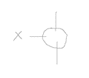

        -   Schließt bei X=H

-   <u>Logische Gatter</u> haben i.d.R. "komplementären" Ausgang

    -   CMOS --> hat pmos und nmos in Gattern (diese sind komplementär)

        -   Ein Schalter am Ausgang ist offen, der andere (komplementäre) Schalter ist geschlossen

    -   Totem Pole

-   <u>Open Collector / OC</u>

    -   Ausgang nicht intern mit VDD verbunden, sondern extern mit Resistor

        -   Kann mehre Ausgänge an diesen Resistor anschließen

        -   Der Strom würde von VCC bei den Schaltern abfließen und nicht zum Ausgang gehen, sollte einer von diesen offen sein (um den Wiederstand zu vermeiden)

    <!-- -->

    -   Heißt faktisch, dass das beim zusammenschließen der Ausgänge noch eine UND-Schaltung impliziert ist

        -   Diese Art Schaltung wir daher noch mit einer Raute versehen

        -   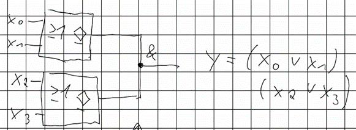

<!-- -->

-   <u>Tri-State</u> ermöglicht es, mehrere Sender an einem Bus zu haben, die abgeschaltet werden können

    -   

<!-- -->

-   *Positive/ Negative Logik*

<!-- -->

-   Hat in der Digitaltechnik 2 Zustände, VDD-0V --> Kann diese den booleschen Zuständen 0/1 frei zuordnen

-   

<table><colgroup><col style="width: 30%" /><col style="width: 24%" /><col style="width: 45%" /></colgroup><thead><tr class="header"><th>Spannung</th><th>Pegel</th><th>Logischer Zustand 
pos. neg.</th></tr></thead><tbody><tr class="odd"><td>5V 
0V</td><td>H 
L</td><td>1 0 
0 1</td></tr></tbody></table>

-   *CMOS*

<!-- -->

-   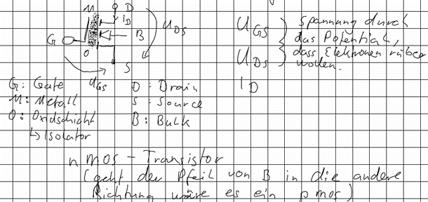

    -   Im statischen Fall (on oder off) fließt kein Strom über das Gate

    -   UGS ist dafür verantwortlich das der Transistor schaltet

        -   pmos lässt Strom durch, wenn KEINE Spannung am Gate anliegt - Ist x LOW, ist Schalter geschlossen

        -   nmos lässt Strom durch, wenn Spannung am Gate liegt - Ist x HIGH ist Schalter geschlossen

-   Fan-Out gibt an wie viele neue Gattereingänge von einem CMOS-Ausgang angesteuert werden können --> meisten 50

-   !!!: Eingänge die nicht benutzt werden, dürfen nicht unbeschaltet bleiben

    -   Würde der Anschluss nicht angeschlossen sein, würden die Ladungen sich unkontrolliert verteilen

    -   Wir müssen einen definierten Zustand erzeugen --> Eingang entweder an GND oder VCC anbinden

<!-- -->

-   Eingangsspannung muss zwischen -0,5V und VDD +0,5V liegen

 

# Schaltnetz

-   Erzeugt aus den Eingangssignalen ein bestimmtes Ausgangssignal - kein Speicher

-   Wird durch eine Schaltfunktion beschrieben

<!-- -->

-   *Struktur Hazard*

<!-- -->

-   Führen zu temporären falschen Ausgangssignalen an den Ausgängen des Schaltnetztes

    -   Wenn 2 Implikanten in der DNF (Disjunktiven Normalform) stehen, wobei einer davon negiert und der andere nicht negiert ist

    <!-- -->

    -   Muss einen zusätzlichen Implikanten einfügen, der diese Schnittstelle überdeckt

<!-- -->

-   *Funktions Hazards*

<!-- -->

-   Entstehenwenn sich zwei Eingangsvariablen ändern, der Ausgangszustand des Schaltnetztes aber auch 1 bleiben sollte

    -   Am KV-Diagramm sichtbar

        -   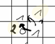

            -   Weg 1 oder Weg 2 - je nachdem welche Variable zuerst Schaltet --> Bei Weg 2 wird der Ausgang kurzzeitig 0 sein

<!-- -->

-   *Hazard Typen*

<!-- -->

-   Statisch

    -   0-Hazard

        -   Signal sollte 1 sein, fällt kurz auf 0 runter

    -   1-Hazard

        -   Signal sollte 0 sein, springt kurz auf 1

-   Dynamisch

    -   0-Hazard

        -   Signal sollte 1 sein, fällt <u>immer wieder</u> kurz auf 0 runter

    -   1-Hazard

        -   Signal sollte 0 sein, springt <u>immer wieder</u> kurz auf 1

>  

# Schaltwerk (SW)

-   Schaltnetz, bei dem zumindest ein Ausgangssignal auf den Eingang zurück geführt wird

-   Das zurückgeführte Signal wird vor dem Zurückleiten verzögert

    -   Das Ergebnis hängt neben den aktuellen Eingangsvariablen und vergangener Zustände ab

        -   Informationen werden gespeichert

-   Um die Analyse des Verhaltens zu bewerkstelligen, müssen die Zustandsgrößen (zi) zwei verschiedenen Zeitpunkten betrachtet werden (m, m+1)

<!-- -->

-   *MOORE/ MEALY*

<!-- -->

-   Grundlegende Unterscheidung der Schaltwerke in 2 Gruppen

<!-- -->

-   *Moore*

<!-- -->

-   Y ist ausschließlich von zm abhänig

-   Nach dem ersten Schaltnetz fließen die Ausgangsvariablen nicht mehr in die Betrachtung ein

-   

<table><colgroup><col style="width: 44%" /><col style="width: 55%" /></colgroup><thead><tr class="header"><th>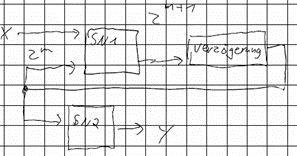</th><th>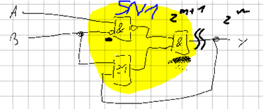</th></tr></thead><tbody></tbody></table>

-   Bei der rechten Abbildung gibt es gar kein SN2 (Gatter nach der Rückführung) daher zm = y

<!-- -->

-   *Mealy*

<!-- -->

-   Y ist sowohl von zm als auch von min. einer Eingangsvariablen x abhängig

-   In einem zweiten Schaltnetz werden die x erneut betrachtet

-   

<table><colgroup><col style="width: 44%" /><col style="width: 55%" /></colgroup><thead><tr class="header"><th>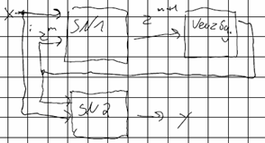</th><th>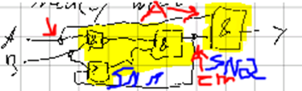</th></tr></thead><tbody></tbody></table>

-   *Flipflops (FF) - Asynchrone SW*

<!-- -->

-   *RS-FF (NOR) & Einführung*

<!-- -->

-   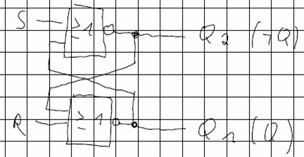

    -   Wahrheitstabelle der Gatter

        -   

<table><colgroup><col style="width: 36%" /><col style="width: 36%" /><col style="width: 27%" /></colgroup><thead><tr class="header"><th> </th><th>OR</th><th>NOR</th></tr></thead><tbody><tr class="odd"><td>0 0</td><td>0</td><td>1</td></tr><tr class="even"><td>0 1</td><td>1</td><td>0</td></tr><tr class="odd"><td>1 1</td><td>1</td><td>0</td></tr><tr class="even"><td>1 0</td><td>1</td><td>0</td></tr></tbody></table>

-   Wahrheitstabelle FF

    -   

<table><colgroup><col style="width: 12%" /><col style="width: 12%" /><col style="width: 14%" /><col style="width: 61%" /></colgroup><thead><tr class="header"><th>S</th><th>R</th><th>Qm+1</th><th> </th></tr></thead><tbody><tr class="odd"><td>0</td><td>0</td><td>Qm</td><td>Speichern (vorheriger Zustand bleibt erhalten)</td></tr><tr class="even"><td>0</td><td>1</td><td>0</td><td>Zurücksetzten (R - Reset)</td></tr><tr class="odd"><td>1</td><td>0</td><td>1</td><td>Setzten</td></tr><tr class="even"><td>1</td><td>1</td><td>--</td><td>VERBOTEN!!! (Inversion würde aufgehoben werden)</td></tr></tbody></table>

-   Alternativ (gleichwertig)

    -   

<table><colgroup><col style="width: 14%" /><col style="width: 14%" /><col style="width: 16%" /><col style="width: 18%" /><col style="width: 35%" /></colgroup><thead><tr class="header"><th>S</th><th>R</th><th>Qm</th><th>Qm+1</th><th> </th></tr></thead><tbody><tr class="odd"><td>0</td><td>0</td><td>1</td><td>0</td><td>Speichern</td></tr><tr class="even"><td>0</td><td>0</td><td>0</td><td>1</td><td> </td></tr><tr class="odd"><td>0</td><td>1</td><td>1</td><td>0</td><td>Zurücksetzten</td></tr><tr class="even"><td>0</td><td>1</td><td>0</td><td>0</td><td> </td></tr><tr class="odd"><td>1</td><td>0</td><td>1</td><td>1</td><td>Setzen</td></tr><tr class="even"><td>1</td><td>0</td><td>0</td><td>1</td><td> </td></tr><tr class="odd"><td>1</td><td>1</td><td>1</td><td>--</td><td>VERBOTEN</td></tr><tr class="even"><td>1</td><td>1</td><td>0</td><td>--</td><td> </td></tr></tbody></table>

-   Linke 3 Spalten sind Eingangsvariablen, rechte 2 die Ausgangsvariablen

<!-- -->

-   Für die weitere Analyse ist ein Auftrennen der Rückkopplung des FF erforderlich, um zm als eigenständige Eingangsgröße zu erfassen

    -   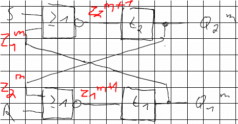

        -   Hieraus können die <u>Übergangs- und Ausgabefunktion</u> ermittelt werden!

            -   Übergangsfunktionen geben die Bedingungen für die Entwicklung der Zustandsgrößen z an

                -   *In die Wahrheitstabelle des Gatters (NOR) gucken und aufschreiben, wann das Gatter HIGH am Ausgang annehmen würde*

                -   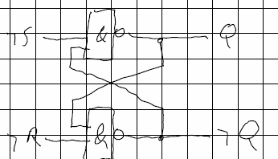

                -   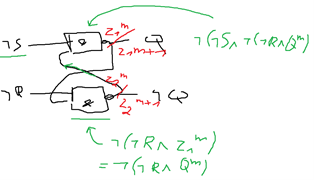

            -   Ausgabefunktionen geben die Bedingungen für den nächsten Zustand der Ausgänge an

                -   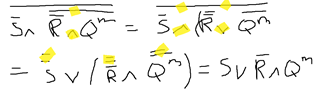

                -   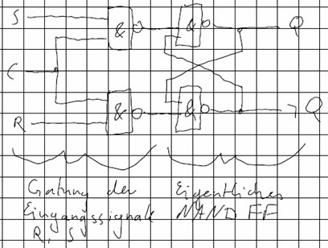

                    -   Daher sind es Moore-Schaltwerke

-   Zustandsfolgetabelle

    -   

<table><colgroup><col style="width: 25%" /><col style="width: 22%" /><col style="width: 19%" /><col style="width: 13%" /><col style="width: 19%" /></colgroup><thead><tr class="header"><th>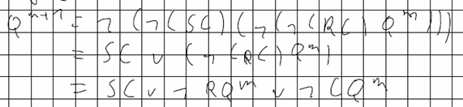</th><th>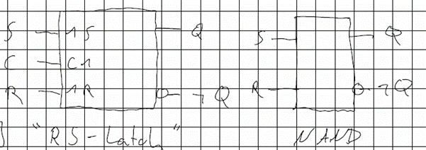</th><th>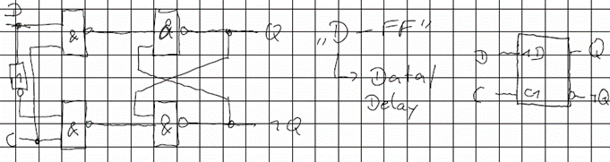</th><th>R S</th><th>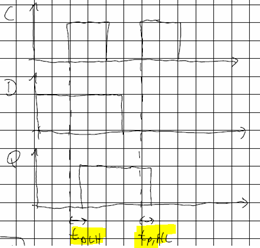</th></tr></thead><tbody><tr class="odd"><td>0 0</td><td><u>1 1</u></td><td>0 1</td><td>0 0</td><td>1 0</td></tr><tr class="even"><td>0 1</td><td>0 1</td><td>0 1</td><td>0 0</td><td>0 0</td></tr><tr class="odd"><td>1 1</td><td><u>0 0</u></td><td><u>0 0</u></td><td><u>0 0</u></td><td><u>0 0</u></td></tr><tr class="even"><td>1 0</td><td>1 0</td><td>0 0</td><td>0 0</td><td>1 0</td></tr></tbody></table>

-   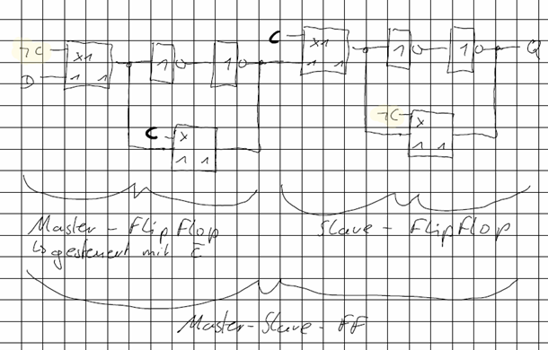

    -   Muss mithilfe der Übergangsfunktion berechnet werden

-   Ändern sich beide Zustandsgrößen in einem Schritt ("Zweikomponentenübergang") --> <u>U</u>

    -   Vergleicht hierbei immer mit der ganz linken Spalte

    -   An diesen Stellen kommt es zu "RACES"

        -   Die kürzere Gatterlaufzeit bestimmt über den neuen Ausgabewert der Schaltung

        -   Diese sollten unter allen Umständen vermieden werden

            -   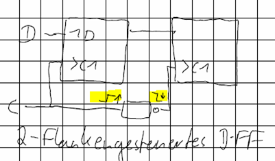

<!-- -->

-   *RS-FF (NAND)*

<!-- -->

-   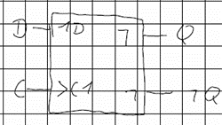

    -   Wahrheitstabelle Gatter

        -   

<table><colgroup><col style="width: 35%" /><col style="width: 35%" /><col style="width: 28%" /></colgroup><thead><tr class="header"><th> </th><th>AND</th><th>NAND</th></tr></thead><tbody><tr class="odd"><td>00</td><td>0</td><td>1</td></tr><tr class="even"><td>01</td><td>0</td><td>1</td></tr><tr class="odd"><td>11</td><td>1</td><td>0</td></tr><tr class="even"><td>10</td><td>0</td><td>1</td></tr></tbody></table>

-   Wahrheitstabelle

    -   

<table><colgroup><col style="width: 23%" /><col style="width: 23%" /><col style="width: 21%" /><col style="width: 31%" /></colgroup><thead><tr class="header"><th>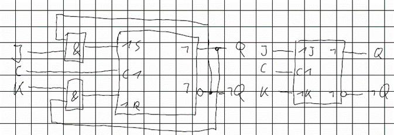</th><th>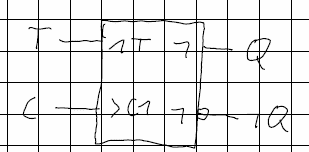</th><th>Qm+1</th><th> </th></tr></thead><tbody><tr class="odd"><td>0</td><td>0</td><td>--</td><td>VERBOTEN!!!</td></tr><tr class="even"><td>0</td><td>1</td><td>0</td><td>Zurücksetzen</td></tr><tr class="odd"><td>1</td><td>0</td><td>1</td><td>Setzen</td></tr><tr class="even"><td>1</td><td>1</td><td>Qm</td><td>Speichern</td></tr></tbody></table>

-   Übergangsfunktion

    -   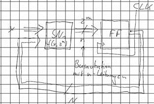

    -   *Herleitung*

        -   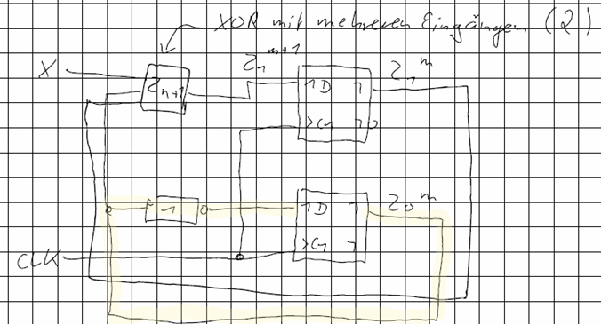

        -   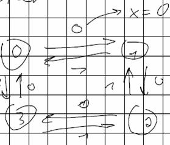

<!-- -->

-   RS-Latch --> Pegelsteuerung

    -   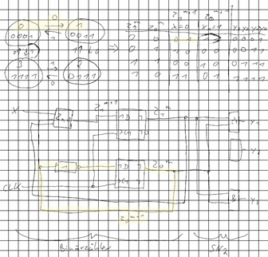

        -   Takt-Pegel-Steuerung sorgt dafür, dass das FF dauerhaft im Speichermodus ist, egal, was an S und R anliegt, AUßER der C-Eingang (aka CLK - Clock - Takt) ist HIGH

            -   Pegel, da S und R IMMER weitergereicht werden, solange C=HIGH (sind am Ausgang transparent)

        -   Wahrheitstabelle

            -   

<table><colgroup><col style="width: 15%" /><col style="width: 15%" /><col style="width: 15%" /><col style="width: 18%" /><col style="width: 35%" /></colgroup><thead><tr class="header"><th>S</th><th>R</th><th>C</th><th>Qm+1</th><th> </th></tr></thead><tbody><tr class="odd"><td>0</td><td>0</td><td>1</td><td>Qm</td><td>Speichern</td></tr><tr class="even"><td>1</td><td>0</td><td>1</td><td>1</td><td>Setzten</td></tr><tr class="odd"><td>0</td><td>1</td><td>1</td><td>0</td><td>Zurücksetzten</td></tr><tr class="even"><td>1</td><td>1</td><td>1</td><td>--</td><td>VERBOTEN!!!</td></tr><tr class="odd"><td>d</td><td>d</td><td>0</td><td>Qm</td><td>Speichern</td></tr></tbody></table>

-   d = "Don't care" wir beachten diese Zustände nicht weiter, weil sie keinen Einfluss haben

<!-- -->

-   Übergangsfunktion

    -   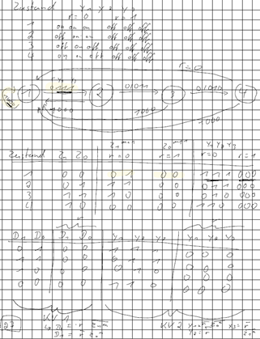

<!-- -->

-   Schaltsymbole

    -   

<!-- -->

-   *D-FF (Takt-Pegel)*

<!-- -->

-   Versucht Problem mit dem verbotenen Zustand zu lösen, indem nur mit einem Eingangssignal, welches Intern aufgeteilt wird, gearbeitet wird

-   C Eingang bestimmt, ob Wert weitergegeben wird

-   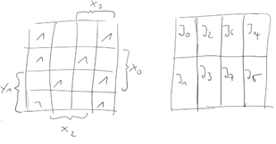

    -   Wahrheitstabelle

        -   

<table><colgroup><col style="width: 22%" /><col style="width: 22%" /><col style="width: 22%" /><col style="width: 33%" /></colgroup><thead><tr class="header"><th>D</th><th>C</th><th>Qm+1</th><th> </th></tr></thead><tbody><tr class="odd"><td>0</td><td>1</td><td>0</td><td>Zurücksetzten</td></tr><tr class="even"><td>1</td><td>1</td><td>1</td><td>Setzten</td></tr><tr class="odd"><td>d</td><td>0</td><td>Qm</td><td>Speichern</td></tr></tbody></table>

-   Übergangsfunktion

    -   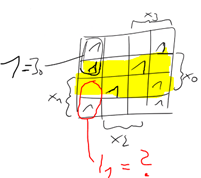

        -   Wenn D HIGH ist und es durchgegeben wird, oder wenn D nicht durchgegeben wird, aber vorher 1 schon gespeichert war

<!-- -->

-   ACHTUNG - Delays bei Taktsteuerung

    -   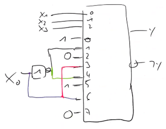

<!-- -->

-   *D-FF (Takt-Flanken)*

<!-- -->

-   Takt-Pegel-Steuerung hat den Nachteil, das der Pegel einen gewissen Zeitraum HIGH ist und sich in diesem die Eingangssignale ändern könnten --> Änderungen des Wertes möglichst nur zu einem ganz bestimmten Zeitraum

    -   Transparentes Verhalten unterbinden

-   Konstruktion

    -   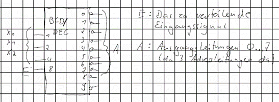

-   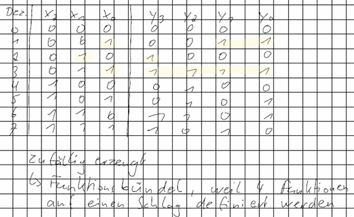

    -   Wahrheitstabelle

        -   

<table><colgroup><col style="width: 14%" /><col style="width: 19%" /><col style="width: 19%" /><col style="width: 19%" /><col style="width: 26%" /></colgroup><thead><tr class="header"><th>D</th><th>C</th><th>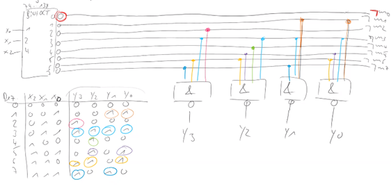</th><th>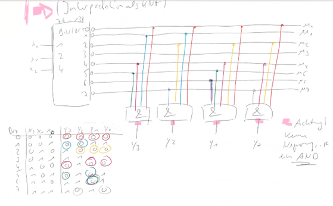</th><th>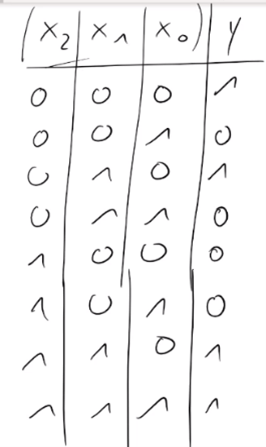</th></tr></thead><tbody><tr class="odd"><td>d</td><td>d</td><td>0</td><td>1</td><td>1</td></tr><tr class="even"><td>d</td><td>d</td><td>1</td><td>0</td><td>0</td></tr><tr class="odd"><td>d</td><td>d</td><td>0</td><td>0</td><td>VERBOTEN!</td></tr><tr class="even"><td>1</td><td>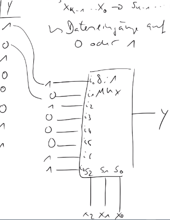</td><td>1</td><td>1</td><td>1</td></tr><tr class="odd"><td>0</td><td></td><td>1</td><td>1</td><td>0</td></tr><tr class="even"><td>d</td><td>0</td><td> </td><td> </td><td>Qm</td></tr><tr class="odd"><td>d</td><td>1</td><td> </td><td> </td><td>Qm</td></tr></tbody></table>

-   Schaltsymbol

    -   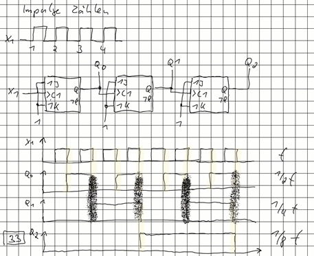

        -   &gt; C gibt an, dass es Takt-Flanken-Gesteuert ist

<!-- -->

-   Funktionsweise

    -   Steigende Flanke von C --> Master beginnt zu speichern

        -   Speichert D, so wie es am Ende des niedrigen Taktpegels anlag

        -   Das Slave-FlipFlop wird transparent (wenn C=H) und Q zeigt das gespeicherte Eingangssignal (Ausgang des Masters)

    -   Wenn der niedrige Taktpegel kommt (Fallende Flanke C) wird die Speicherfunktion durch das Slave-FF übernommen --> gibt weiterhin Q aus

        -   Nun ist das Master-FF transparent und gibt das jetzt anliegende Signal D an den Eingang des Slaves weiter

    -   Wenn C wieder steigt beginnt es von vorne

        -   Kein Transparentes Verhalten, da immer eines der Beiden FF speichert (durch Ansteuerung mit dem invertierten C)

<!-- -->

-   *JK-FF*

<!-- -->

-   Ausgänge vom FlipFlop werden wieder auf seine eigenen Eingänge gekoppelt

    -   Stellt sicher, dass nie R=S=1 auftritt, weil nur zurückgesetzt (R) werden kann wenn vorher Daten gesetzt waren

    -   Bietet die Funktion, dass bei J=K=1 die Ausgänge "getoggelt" (umgeschaltet) werden

-   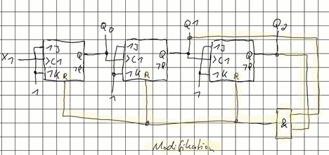

    -   Wahrheitstabelle

        -   

<table><colgroup><col style="width: 17%" /><col style="width: 17%" /><col style="width: 17%" /><col style="width: 20%" /><col style="width: 27%" /></colgroup><thead><tr class="header"><th>C</th><th>J</th><th>K</th><th>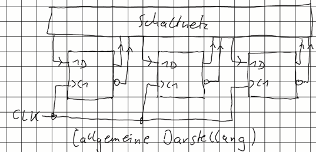</th><th> </th></tr></thead><tbody><tr class="odd"><td>1</td><td>0</td><td>0</td><td>Qm</td><td>Speichern</td></tr><tr class="even"><td>1</td><td>0</td><td>1</td><td>0</td><td>Zurücksetzten</td></tr><tr class="odd"><td>1</td><td>1</td><td>0</td><td>1</td><td>Setzten</td></tr><tr class="even"><td>1</td><td>1</td><td>1</td><td></td><td>Toggeln</td></tr><tr class="odd"><td>0</td><td>d</td><td>d</td><td>Qm</td><td>Speichern</td></tr></tbody></table>

-   Solange nicht J=K=1: Verhalten wie RS-MS-FF

<!-- -->

-   *T-FF*

<!-- -->

-   Vereinfachter JK-FF (JK, nur beide Eingänge sind permanent zusammengeschaltet), der nur die Toggle-Funktion wiedergeben soll

-   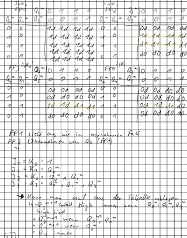

    -   Wahrheitstabelle

        -   

<table><colgroup><col style="width: 33%" /><col style="width: 31%" /><col style="width: 34%" /></colgroup><thead><tr class="header"><th>C</th><th>T</th><th>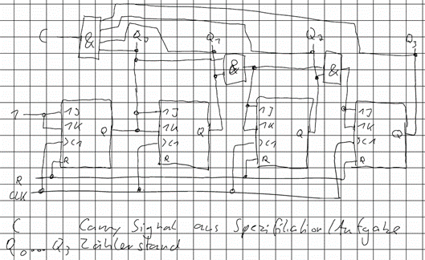</th></tr></thead><tbody><tr class="odd"><td>0</td><td>0</td><td></td></tr><tr class="even"><td>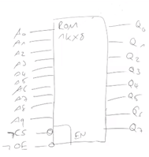</td><td>0</td><td>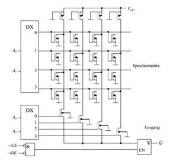</td></tr><tr class="odd"><td>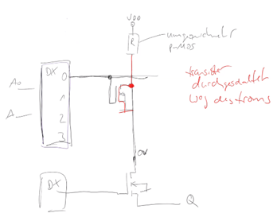</td><td>1</td><td>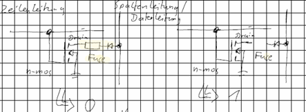</td></tr></tbody></table>

-   *Synchrone SW*

<!-- -->

-   "Zustand": eine Kombination mehrerer Zustandsvariablen

    -   Bei n Zustandsvariablen --> 2n unterschiedliche Zustände

-   Unterschied zu asynchronen SW sind die FF als Zustandsspeicher

    -   Die Indizes m, m+1 kennzeichnen aufeinanderfolgende Perioden des Taktes CLK

    -   Die neuen Zustandsvariablen z^(m+1) werden mit der steigenden Taktflanke in die FF eingelesen (und werden danach über die Rückkopplung am Eingang des SN sichtbar)

-   Hazard und Races spielen keine Rolle, da alles durch die Taktflanken gesteuert wird

    -   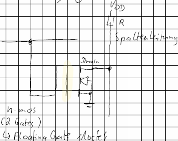

#  

# FF 101

-   *Gleichungen ablesen (Zustands- & Übergangsgleichungen)*

<!-- -->

-   …

<!-- -->

-   *Taktsteuerung*

<!-- -->

-   tW: Wirkinterwall

    -   Signal muss diese Zeit konstant sein --> Sonst wird ein zufälliger Wert gespeichert

-   Zum erfolgreichen Speichern muss das Eingangssignal

    -   Kurz vor dem Taktsignal (ts - Setup) hochgehen & konstant bleiben

    -   Nach dem Taktsignal etwas warten (th - Hold), bevor es sinkt \[Bei Takt-Flanken-Steuerung, sonst reicht tw\]

-   Transparent

    -   Das FF ist Transparent, wenn es sein Eingangssignal (nach der Verzögerung) direkt am Ausgang präsentiert

 

# FFs in der Anwendung

-   *Binärzähler (Synchrones SW)*

<!-- -->

-   Schaltwerk, welches binär nach oben Zählt (pro FF eine Stelle)

    -   Pro Takt wird der gespeicherte Wert um eins erhöht

        -   Z0 kippt mit jedem Takt, weil es die hinterste Stelle der Binärzahl ist

        -   Z1 kippt mit jedem 2. Takt --> Hier mit XOR (Exklusives Oder) realisiert, jeder ungerade Takt

    -   2 Taktflankengesteuerte D-FF

-   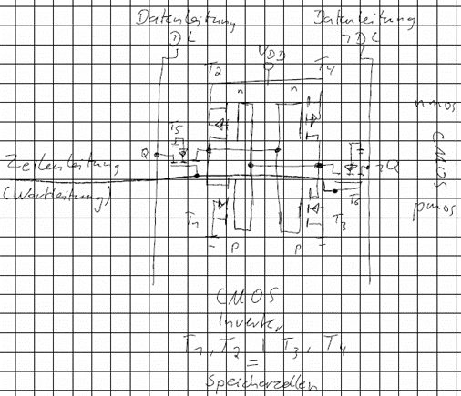

    -   2 Zustandsvariablen --> 2 Übergangsfunktionen

        -   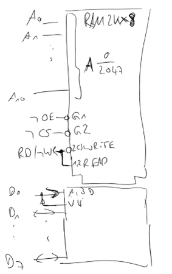

        -   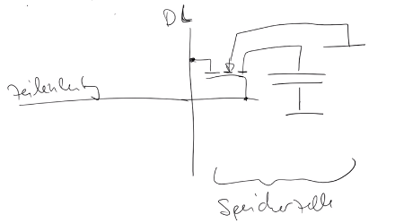

    -   Zustandsfolgetabelle

        -   

<table><colgroup><col style="width: 33%" /><col style="width: 32%" /><col style="width: 33%" /></colgroup><thead><tr class="header"><th> </th><th>X=0</th><th>X=1</th></tr></thead><tbody><tr class="odd"><td></td><td></td><td></td></tr><tr class="even"><td>0 0</td><td>0 1</td><td>1 1</td></tr><tr class="odd"><td>0 1</td><td>1 0</td><td>0 0</td></tr><tr class="even"><td>1 1</td><td>0 0</td><td>1 0</td></tr><tr class="odd"><td>1 0</td><td>1 1</td><td>0 1</td></tr></tbody></table>

-   Wir haben einen Zähler --> Man kann die Binärzahlen also auch gleich als DEC aufschreiben

    -   

<table><colgroup><col style="width: 45%" /><col style="width: 54%" /></colgroup><thead><tr class="header"><th> </th><th>zm+1</th></tr></thead><tbody><tr class="odd"><td>zm</td><td>X=0 X=1</td></tr><tr class="even"><td>0</td><td>1 3</td></tr><tr class="odd"><td>1</td><td>2 0</td></tr><tr class="even"><td>3</td><td>0 2</td></tr><tr class="odd"><td>2</td><td>3 1</td></tr></tbody></table>

-   Zustandsübergangsdiagramm

    -   *Bildet alle möglichen Zustände UND die Wege, die man von einem zum anderen Zustand kommt ab*

    -   

 

 

# Moore/ Mealy Übungen

-   Schaltwerk - Synchron - MOORE

    -   4 Ausgänge, die 4 LEDs blinken lassen (Zustand 1 = 1 LED, ZS 2 2LEDs, ZS3 3, ZS4 4)

        -   Zum Aufstellen mit dem Zustandsdiagram anfangen

            -   Dezimalzahl für die Nummer des Zustands (in der Tabelle mit Gray-Code codiert)

            -   Darunter die Beschaltung der Ausgänge

        -   Daraus die Tabelle ableiten

            -   Erste zwei Spalten aufstellen und dann den Rest ausfüllen

        -   Gatter zeichnen

            -   Vergleichbare Struktur suchen --> Binärzähler

            -   Ausgänge ergänzen --> weiteres Schaltnetz hinzufügen

                -   Dieses ist NUR abhängig von den Variablen im Speicher --> Daher MOORE

                -   Zustandsgleichungen aus Wertetabelle ablesen - y0 = !z1m!z2m

-   Schaltwerk - Synchron - MEALY

-   Eingangsvariablen beeinflussen das 2. Schaltnetz

    -   4 Zustände, Ansteuerung von 3 Maschinen --> sollen separat angesteuert werden können

    -   Eingangsvariable r = 0, 4 Zustände werden zyklisch durchlaufen - r:1 SW soll in den Zustand 1 gehen (reset, Not-Aus)

-   Zum bauen bräuchte man für binäre Codierung der Zustände ld(4) FF --> 2 FF

    -   Die Codierung muss selbst festgelegt werden, da sie keinen allgemeinen Regeln entspricht

    -   Zustandsfolgetabelle Aufstellen

    -   Tabelle wieder in Schaltung aufdröseln --> Übergangsgleichung für FF-Eingänge aufstellen

        -   KV-Diagramm

            -   Sieht das Mealy vorliegt, weil bei jeder Ausgangsvariable eine Verknüpfung zwischen Eingangsvariable (r) und Zustand vorliegt

-   

<table><colgroup><col style="width: 51%" /><col style="width: 48%" /></colgroup><thead><tr class="header"><th></th><th></th></tr></thead><tbody></tbody></table>

-   Weiterschaltung zwischen den Zuständen über das Taktsignal --> "autonomer Automat"

 

 

# Zustandscodierung

-   Eigentlich nur wichtig, dass die Zustände irgendwie auseinander gehalten werden können

<!-- -->

-   *Binär*

    -   Für vier Zustände 2 FF, da zwei Zustandsvariablen (ZV)

    -   00,01,10,11

-   *Gray-Code*

    -   Für vier Zustände 2 FF, da zwei (ZV)

    -   Jeweils nur ein Bit darf sich ändern

    -   Wird häufig benutzt, wenn Zustände zyklisch durchlaufen werden

-   *BCD*

-   *Ausgangsorientiert*

    -   Spart sich Dekodierung (Wegfall vom 2. SN)

    -   Für jeden Ausgang ein Zustand, also auch ein FF

        -   3 FF, 3 ZV

-   *One-Hot*

    -   Einer von x ist an

    -   Für jeden Zustand ein FF

        -   Meist als rotierendes Schieberegister --> Man spart sich SN1

        -   Init um auf Ausgangszustand zu setzten und dann wird das heiße Bit immer weiter geschoben

        -   

>  

-   BSP Ampel

    -   

<table><colgroup><col style="width: 12%" /><col style="width: 16%" /><col style="width: 13%" /><col style="width: 12%" /><col style="width: 29%" /><col style="width: 14%" /></colgroup><thead><tr class="header"><th> </th><th> </th><th>Binär</th><th>Gray</th><th>Ausgangsorientiert</th><th>One Hot</th></tr></thead><tbody><tr class="odd"><td> </td><td>Zustände</td><td>Z1 Z0</td><td>Z1 Z0</td><td>Z2 Z1 Z0</td><td>Z3 Z2 Z1 Z0</td></tr><tr class="even"><td>1</td><td>rot</td><td>0 0</td><td>0 0</td><td>1 0 0</td><td>0 0 0 1</td></tr><tr class="odd"><td>2</td><td>rotgelb</td><td>0 1</td><td>0 1</td><td>1 1 0</td><td>0 0 1 0</td></tr><tr class="even"><td>3</td><td>gelb</td><td>1 0</td><td>1 1</td><td>0 1 0</td><td>0 1 0 0</td></tr><tr class="odd"><td>4</td><td>grün</td><td>1 1</td><td>1 0</td><td>0 0 1</td><td>1 0 0 0</td></tr></tbody></table>

 

 

# Anwendungen

-   *Multiplexer*

<!-- -->

-   Baustein, der einen von n digitalen Eingängen auswählt und auf den Ausgang schaltet

    -   Hat dafür n Eingänge und log2(n) Selektionseingänge

    -   Wahrheitstabelle

        -   

<table><colgroup><col style="width: 20%" /><col style="width: 22%" /><col style="width: 41%" /><col style="width: 15%" /></colgroup><thead><tr class="header"><th>EN</th><th>X2 x1 x0</th><th>I7 i6 i5 i4 i3 i2 i1 i0</th><th>Y</th></tr></thead><tbody><tr class="odd"><td>1</td><td>d d d</td><td>d d d d d d d d</td><td>0</td></tr><tr class="even"><td>0</td><td>0 0 0</td><td>D D d d d d d x</td><td>I0</td></tr><tr class="odd"><td>0</td><td>0 0 1</td><td>D D d d d d x d</td><td>I1</td></tr><tr class="even"><td>0</td><td>0 1 0</td><td>D D d d d x d d</td><td>I2</td></tr><tr class="odd"><td>0</td><td>0 1 1</td><td>D D d d x d d d</td><td>I3</td></tr><tr class="even"><td>0</td><td>1 0 0</td><td>D D d x d d d d</td><td>I4</td></tr><tr class="odd"><td>0</td><td>1 0 1</td><td>D D x d d d d d</td><td>I5</td></tr><tr class="even"><td>0</td><td>1 1 0</td><td>D X d d d d d d</td><td>I6</td></tr><tr class="odd"><td>0</td><td>1 1 1</td><td>X d d d d d d d</td><td>I7</td></tr></tbody></table>

-   Kann zur Realisierung von Schaltungen verwendet werden

    -   Ausgang des MUX soll den Funktionswert ausgeben

        -   X3, x2, x1 - Steuersignale + x0 eine der Eingangsvariablen

    -   

    -   Dateneingänge werden nach folgenden Regeln beschaltet

        -   Bereich (In) keine 1 --> Durchgang erhält eine 0

        -   Bereich hat zwei 1 --> Durchgang erhält eine 1

        -   Bereich hat nur eine 1 --> Beschaltung mit x0 oder !x0

    <!-- -->

    -   KOCHREZEPT

        -   Ein 8:1 MUX hat 3 Selektionseingänge --> festlegen welche 3 Variablen das sind

            -   x3,x2,x1

            -   Vierte Variable x0 wird auf die Eingänge geschaltet (im folgenden ermitteln wie)

        -   Beschaltung ermitteln

            -   Wenn ein Bereich im KV-Diagramm keine 1 enthält, muss eine 0 an den Dateneingang

            -   Wenn zwei 1 im Bereich sind, wird der Eingang mit einer 1 beschaltet

            -   Wenn der Bereich nur eine 1 enthält ?

            -   

                -   Muss I1 hier mit x0 oder !x0 beschaltet werden?

                    -   Muss mit !x0 beschaltet werden, da die 1 nicht von x0 überdeckt wird

                -   Selbe Frage für I4, I6, I3

                    -   Bei I3 und I6 überdeckt x0 die 1

                    -   Bei I4 überdeckt x0 NICHT die 1

    -   

<!-- -->

-   *DEMUX*

<!-- -->

-   Umwandlung aus einem binären Code in einen 1-aus-n-Code

    -   Reziprok zum Multiplexer

    -   Kann auch als Codeumsetzter fungieren

-   

-   Zeitmultiplex: Erst 10ms Signal I0, dann 10ms Signal I2, …, dann 10ms Signal I7, dann 10ms I0, …

    -   Zeitscheibenverfahren | TDM Time Devision Multiplex

<!-- -->

-   *Code-MUX/Umsetzer zur Erzeugung von Funktionsbündeln*

<!-- -->

-   Folgendes Funktionsbündel soll aus der Tabelle umgesetzt werden

-   

    -   Da es 8 Bedingungen (und 3 Eingänge) gibt, sollte ein Octalwandler (BIN/OCT) verwendet werden

    -   2 Möglichkeiten die Tabelle zu interpretieren

        -   Sollte sich danach entscheiden, ob es mehr 1en oder 0en gibt, um schreibaufwand zu sparen (technisch geht beides jederzeit)

        -   Tabelle als DNF interpretieren (Mehr 0en)

            -   Für jeden der 4 Ausgänge an NAND Gatter anlegen

            -   Die Ausgänge des Wandlers an den NAND Gattern anschließen, an denen eine 1 in der Spalte vor liegt

            -   

>  

-   Tabelle als KNF interpretieren (Mehr 1en)

    -   Für jeden der 4 Ausgänge an AND Gatter anlegen

    -   Die Ausgänge des Wandlers an den AND Gattern anschließen, an denen eine 0 in der Spalte vor liegt

> 

-   *Code MUX für einfache Schaltungen*

<!-- -->

-   Für n Eingangsvariablen, bei n Steuersignale am MUX

    -   Die Steuersignale an die Variablen anschließen

    -   1/0 an die Eingänge, je nachdem, ob die Funktion bei dieser Kombination eine 1 liefern soll

-   

<table><colgroup><col style="width: 44%" /><col style="width: 55%" /></colgroup><thead><tr class="header"><th></th><th></th></tr></thead><tbody></tbody></table>

-   *Analoger MUX/DEMUX*

<!-- -->

-   Multiplexer verarbeiten nur digitale Signale --> Braucht "Transmission Gates"

    -   Diese Leiten ein Signal bidirektional von Ein-/Ausgang 1 zu 1, wenn Eingang X1 HIGH ist

-   Die Ausgänge des Signalumsetzter bestimmen, welcher Analoger Eingang durchgeschaltet wird

    -   Es wird jeweils ein Transmission Gate geöffnet

        -   TGs dempfän, ggf. muss verstärkt werden

<!-- -->

-   *Digitale Zähler*

<!-- -->

-   Synchrones/ asynchrones Schaltwerk

    -   kettenförmig angeordnete Register (sprich Flipflops)

-   Registerinhalt entspricht dem Zählerstand (BIN, linkes FF hat Wertigkeit x\*2^0, das nächste x\*2^1, usw.)

<!-- -->

-   *10.1 asynchrone Zähler*

<!-- -->

-   Eingangssignal: zu Zählende Impulsfolge

<!-- -->

-   

    -   MODULO-8-Zähler

        -   8 Zählerstände, die periodisch durchlaufen werden, danach beginnt der Zähler wieder bei 000

    -   Auch noch ein Frequenzteiler

<!-- -->

-   Mod-6-Zähler

-   Keine Zweierpotenz, aber noch gerade --> MOD4 ist zu klein --> MOD8 modifizieren

    -   Bei welchem Zählerstand muss ich mit dem zählen aufhören

        -   Bei 1102 (710) wird der erste verbotene Zählerstand erreicht

            -   FF auf einen definierten Zustand zurücksetzten (JK R Eingang)

    -   Ausgänge abgreifen und UND-Verknüpfen --> Sobald der verbotene Zählstand erreicht wurde --> Zähler zurücksetzten

        -   Es gibt eine kurzen Zeitpunkt, wo der verbotene Zustand erreicht wird - Tolerierbar?

-   Bei einem Rückwärtszähler werden die negierten Ausgänge weitergeleitet

    -   

<!-- -->

-   *Synchrone Zähler*

<!-- -->

-   Takteingang wird gleichzeitig angesteuert (als das benutzt, wofür er gedacht war)

-   Alle Register/FF schalten quasi gleichzeitig

-   Nächster Zustand wird aus einem Schaltnetz bestimmt

-   

-   4-Bit-Dualzähler

    -   Zähler mit 4-Bit (0000 - 1111), soll Übertragssignal haben, das beim Überlauf von 1111-->0000 schaltet

    -   *In der Klausur max. 3-Bit Zähler (wg. Zeit)*

    -   Vorgehen

        -   Zustandsfolgetabelle

        -   FF wählen

            -   Ansteuergleichungen: Ansteuerung für einen Wechsel von einem Zustand zu einem anderen

            -   JK Tabelle Aufstellen - Ansteuergleichung

        -   KV Diagramme aufstellen

            -   4 Bit --> 4 FF --> 4 KV Diagramme a 4 variablen

    -   

<table><colgroup><col style="width: 49%" /><col style="width: 50%" /></colgroup><thead><tr class="header"><th></th><th></th></tr></thead><tbody></tbody></table>

> 

-   *11 Schieberegister*

<!-- -->

-   Verkettete FFs, die ihren Wert immer an den nächsten Weitergeben

-   

    -   Eingangssignal E, Ausgangssignal A

    -   Anwendungsgebiete

        -   Multiplikation/ Division in Mikroprozessoren

        -   Seriell/ Parallel-Wandler (E als Eingang und Q0…Q3 als Ausgang)

        -   Parallel/ Seriell Wandler (Q0…Q3 als Eingang, A als Ausgang)

        -   FiFo-Speicher (FirstInFirstOut)

    -   Funktion in Gleichung

        -   Q0m+1=Em

        -   Qim+1=Qi-1m

            -   i kennzeichnet das FF (Nummeriert von links nach rechts)

        -   Am=Q4m

 

 

# Speicher

-   *Arten*

<!-- -->

-   

<table><colgroup><col style="width: 17%" /><col style="width: 34%" /><col style="width: 48%" /></colgroup><thead><tr class="header"><th> </th><th>A</th><th>B</th></tr></thead><tbody><tr class="odd"><td>Kapazität</td><td>
Halbleiterspeicher
<ul class="incremental"><li><blockquote>
Chips
</blockquote></li></ul></td><td>
Massenspeicher
<ul class="incremental"><li><blockquote>
Speichern große Informationsmägen
</blockquote><ul class="incremental"><li><blockquote>
HDD
</blockquote></li><li><blockquote>
CD-ROM
</blockquote></li><li><blockquote>
Magnetbänder
</blockquote></li></ul></li></ul>
SSDs sind Halbleiter (Übergänge in der Moderne)
</td></tr><tr class="even"><td>Zugriffsart</td><td>
Seriell
<ul class="incremental"><li><blockquote>
Schieberegister/ FiFo
</blockquote></li></ul></td><td>
Wahlfrei
<ul class="incremental"><li><blockquote>
Jeder Speicherplatz ist zu jeder Zeit frei zugänglich
</blockquote></li></ul></td></tr><tr class="odd"><td>Persistenz</td><td>
Flüchtig
<ul class="incremental"><li><blockquote>
Wenn Strom weg, sind Daten weg
</blockquote></li></ul></td><td>
Nicht flüchtig
<ul class="incremental"><li><blockquote>
Behält Information bei ausschalten der Betriebsspannung
</blockquote></li></ul></td></tr><tr class="even"><td>Informationen speichern</td><td>Festwertspeicher</td><td>Schreib-/ Lesespeicher</td></tr><tr class="odd"><td>Organisation des Speichers</td><td>
Bit
<ul class="incremental"><li><blockquote>
Jedes Bit kann einzeln angesprochen werden
</blockquote></li></ul></td><td>
Wortweise
<ul class="incremental"><li><blockquote>
Eine Bestimmte Anzahl von Bits muss gleichzeitig angesprochen werden
</blockquote></li></ul></td></tr></tbody></table>

-   Speicher werden an Bus-System angeschlossen um angesteuert zu werden

    -   Mehrere Speicher an einem Bus

    -   Unterscheidung nach Zweck des Busses

<!-- -->

-   *ROM*

<!-- -->

-   Nicht flüchtige, Festwertspeicher (einige können umprogrammiert werden)

    -   Speicherzellen liegen immer an den Schnittpunkten von Zeilen- und Datenleitung

        -   N\*N Speicherplätze in der Matrix mit 2\*N Leitungen

        -   Liegt Strom auf der Zeilenleitung einer Speicherzelle wird der Inhalt gelesen - Die Spaltenleitung gibt eine spezielle der Speicherzellen der Zeile auf den Ausgang

    -   1kx8

        -   1KB Speicher

        -   8er Wortbreite (gibt KEIEN Aussage über die Kapazität, Bestimmt Anzahl der Q)

        -   Adressleitungen: ld(1024) = log2(1024) = 10 (Bestimmt Anzahl der A)

        -   

            -   CS - Chip Select (BUS spricht so den Chip an, wenn LOW --> Chip wird gesteuert)

            -   OE - Output Enabled (Wenn LOW geben Q0..Q7 die Daten der Speicherzellen an den Bus raus)

<!-- -->

-   1er Wortbreite

    -   

<table><colgroup><col style="width: 45%" /><col style="width: 54%" /></colgroup><thead><tr class="header"><th></th><th></th></tr></thead><tbody></tbody></table>

-   Funktion

    -   Zeilendecoder wählt eine Zeile aus (abhängig von den Adresseingängen geht eine Zeile auf H)

    -   Datenleitungen an denen ein MOSFET hängt gehen auf L (andernfalls bleiben sie H)

    -   Durch den Spaltendecoder wird einer der ASS-Transistoren aktiviert und die entsprechende Datenleitung wird auf den Ausgang gelegt

-   Wenn D nicht verbunden ist, sieht man das Potential VDD am Ausgang (auch wenn dieser ausgewählt wurde), weil der Strom nicht zum GND des Transistors fließen kann

<!-- -->

-   

<table><colgroup><col style="width: 17%" /><col style="width: 28%" /><col style="width: 17%" /><col style="width: 19%" /><col style="width: 17%" /></colgroup><thead><tr class="header"><th>Bezeichnung</th><th>Eigenschaften</th><th>Lesen</th><th>Schreiben</th><th>Löschen</th></tr></thead><tbody><tr class="odd"><td>ROM 
Read-Only Memory</td><td><em>Vgl. oben</em></td><td><em>Vgl. oben</em></td><td>
Nur 1x in der Fabrik (durch Maske)

Bits werden auf 0 gesetzt, indem die Drains der Transistoren an die entsprechenden Datenleitungen gelötet werden
</td><td>--</td></tr><tr class="even"><td>PROM 
Programmable ROM</td><td>Ab Werk alle Bits 0</td><td>-""-</td><td>
Kann 1x selber programmiert werden

Durch hohe Spannungen werden die Sicherungen zwischen Drain und Datenleitung gezielt geschmolzen --&gt; Bit auf 1 gesetzt
</td><td>--</td></tr><tr class="odd"><td>EPROM 
Ereasable EPROM</td><td>
MOSFET mit <u>zusätzlichen (FLOATING) Gate</u>, das keine Verbindung nach außen hat
<ul class="incremental"><li><blockquote>
Zustand des FG bestimmt Funktion des Transistors
</blockquote></li></ul></td><td>
Ist keine Ladung auf dem Floating-Gate kann es vollständig ignoriert werden --&gt; Funktioniert wie ein normaler n-mos-Transistor (Da Drain angeschlossen - 0).

Wenn FG geladen, D ist gesperrt - 1
</td><td>Kann aus dem gelöschten Zustand mit höheren Spannungen die Floatinggates wieder aufladen --&gt; Bits auf 1 gesetzt (Transistor schließt bei anliegender Zeilenspannung nicht mehr --&gt; Strom würde in Spalte nicht abfließen)</td><td>Durch Bestrahlung mit UV-Licht wird das isolierende Metalloxid in den Transistoren leitend und die gespeicherten Spannungen fließen ab --&gt; alle wieder auf 0</td></tr><tr class="even"><td>
EEPROM

Electrically EPROM
</td><td>
<em>Vgl. EPROM</em>

Abstand zwischen Floatinggate und Kanal (S,B,D) verringert.

Kann FG elektronisch aufladen und entladen
</td><td>-""-</td><td>-""-</td><td>Kann durch Spannung die gespeicherte Ladung von Floatinggate wieder entfernen --&gt; auf 0 setzten</td></tr></tbody></table>

-   

-   

<!-- -->

-   *RAM*

<!-- -->

-   Flüchtige, schreib-/lesespeicher

    -   NVRAM als Ausnahme (Zwitter aus RAM und ROM) --> Bei Ausschalten werden Daten des RAMs in internen EEPROM gesichert und beim Einschalten wieder hergestellt

-   Random Access Memory

-   Aufbau als Matrix (vgl. ROM) aus Flipflops (STATISCH) oder Transistoren (DYNAMISCH)

    -   Dynamische Speicher haben Verlusteffekte --> Muss den Wert regelmäßig, mindestens nach jedem Lesen auffrischen

<!-- -->

-   *Statisch*

<!-- -->

-   Aufbau

    -   

        -   Auswahl einer Speicherzelle

            -   HIGH auf die Wort-/Zeilenleitung --> Aktiviert T5 & T6 --> sind dann leitend

        -   Anlegen eines H auf die Datenleitung \[**SCHREIBEN**\]

            -   Speicherzelle wird beschrieben

                -   T3 leitet, T4 sperrt --> rechter Inverter gibt ein L aus

                -   Damit wird der linke Inverter auf H gesteuert --> H im Speicher

                -   Es ergibt sich ein FF

            -   Ein Anlegen von H auf der anderen Datenleitung führt zum selben Vorgang nur spiegelbildlich

                -   Linker Inverter wird durchgeschaltet --> L im Speicher

        -   \[**LESEN**\]

            -   Auswahl der Speicherzelle über die Wortleitung

            -   Gucken, was auf der Datenleitung für ein Wert erscheint

-   Schaltzeichen

    -   

        -   Kann nur erkennen, dass es statisch ist, da dynamisch mehr Leitungen braucht

        -   D sind bidirektional

<!-- -->

-   *Dynamisch*

<!-- -->

-   Aufbau

    -   

-   Funktionsweise

    -   Auswahl der Speicherzelle mit der Zeilenleitung

    -   Die im Kondensator gespeicherte Ladung kann über die Datenleitung DL abfließen

        -   Wird im Leseverstärker (siehe ROM) registriert

    -   Nach dem Lesevorgang ist die gespeicherte Ladung abgeflossen --> der Kondensator muss wieder aufgeladen (AUFGEFRISCHT) werden

        -   Nach einem Lesevorgang regeneriert ein DRAM automatisch seine Informationen

    -   Durch mehr Zellen pro Chip werden die Kondensatoren kleiner

        -   Wird eine gewisse Zeit nicht gelesen, besteht die Gefahr, dass die Ladungen selbständig abfließen

        -   Es wird periodisch eine wieder Auffrischung durchgeführt (automatische Leseanforderung)

<!-- -->

-   *Timing*

<!-- -->

-   Welche Zeiten müssen beachtet werden (z.B. vom anlegen der Adressen bis RAS/CAS aktiviert werden kann)

-   RAS-to-CAS delay/latency

    -   Zeit, die gewartet werden muss bevor nach dem Anlegen der Zeileninformationen die Spalteninformationen angelegt werden können

    -   tRCD Time RAS to CAS Delay

-   CL

    -   CAS Latency

    -   Zeit die vergeht zwischen absenden des Lesekommandos (Zeilen anlegen, RAS-to-CAS warten, Spalten anlegen (LeseCMD), CL warten) und Erhalt der Daten

        -   Je kleiner, desto schneller ist der Chip beim Datenabruf

-   RAS-pulse-width

    -   Zeit, die gewartet werden muss, bevor die nächste Information angelegt werden darf

    -   Weil die Zeilen nach dem Auslesen wieder aufgeladen werden müssen

    -   Aka "Bank Active Time" --> tRAS

-   Row Precharge Time

    -   tRP

    -   Lade-/ Entladekurve von Kapazitäten

        -   Auch die Zuleitungen sind Kapazitäten --> auch diese müssen geladen und entladen werden --> dafür müssen gewisse Zeiten gewartet werden, bis die Spannungsniveaus auf diesen Leitungen wieder im Ausgangszustand sind

<!-- -->

-   *Sonderarten*

<!-- -->

-   SDRAM - Synchronous Dynamic RAM

    -   Kondensatoren als Aufbau, die Timings laufen gekoppelt/ synchron zum Prozessortakt (keine zusätzlichen Wartezeiten durch Taktversatz)

    -   Kann zu einer Taktflanke (Sigle Data Raid) oder zu beiden Taktflanken (Double Data Raid) synchronisieren

        -   SD

            -   PC100, PC133

            -   Nummer gibt Taktrate in MHz an

        -   DDR x

            -   x Prefetch Parameter --> Daten werden schon gelesen, bevor sie angefragt werden

                -   2: Lädt die doppelte Menge an Daten (auch wenn diese nicht angefragt wurden), werden diese danach abgefragt, kann man sie viel schneller (ohne Wartezeiten) ausgeben

<!-- -->

-   *Erweiterung und Kaskadierung*

<!-- -->

-   Z.B. bei 16 Bit Adressbus aber nur 8 Bit Datenbus mit kleinen Speicherbausuteinen

    -   Wie muss man die einzelnen 2k-Speicherbausuteine verschalten, dass insgesamt 8k Speicher vorhanden sind

        -   Hauptproblem: Decodierung des 8k Adressraums, um die 2k Speicherbausteine anzusprechen

            -   Volldecodierung (A0..A15) - Alle Adressleitungen werden genutzt, jeder Speicherplatz hat nur eine Adresse (im 16bit Adressraum)

            -   Teildecodieren (A0..A12) - Nicht alle Adressleitungen werden genutzt

                -   A12 ermöglicht Adressraum bis 8192 - A13..A5 werden nicht decodiert (don't care) --> Senkt Hardwareaufwand

            -   Lineare Decodierung

                -   Verzicht auf Decodierung, Adressleitungen A11-A14 werden direkt auf CS Leitungen der Speicherchips gelegt

                -   A15 nicht genutzt

                -   Software muss Lücken beachten

-   

<table><colgroup><col style="width: 13%" /><col style="width: 30%" /><col style="width: 55%" /></colgroup><thead><tr class="header"><th>Kodierungsart</th><th>Schaltung</th><th>Adressplan</th></tr></thead><tbody><tr class="odd"><td>Vollkodierung</td><td></td><td></td></tr><tr class="even"><td>Teilkodierung</td><td></td><td></td></tr><tr class="odd"><td>Lineare-</td><td></td><td></td></tr></tbody></table>
